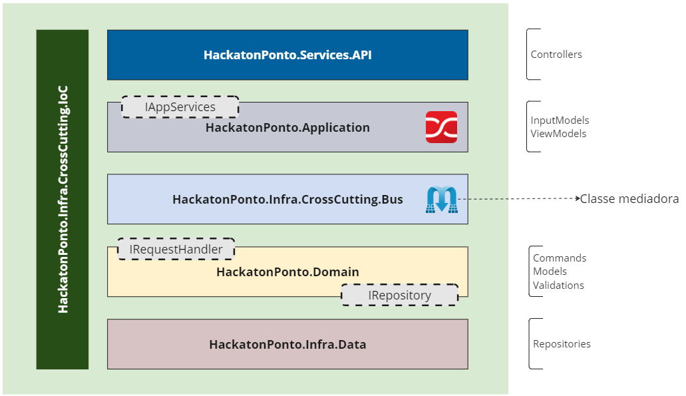

# [FIAP - Pos Tech] Hackathon

FIAP Pos Tech - SOFTWARE ARCHITECTURE

SOAP2 - Grupo 7

#### Sumário
   * [O projeto](#o-projeto)
   * [Documentações](#documentações)
   * [Pré-requisitos](#pré-requisitos)
   * [Como rodar a aplicação <g-emoji class="g-emoji" alias="arrow_forward" fallback-src="https://github.githubassets.com/images/icons/emoji/unicode/25b6.png">▶️</g-emoji>](#como-rodar-a-aplicação-️)
   * [Como rodar a aplicação na nuvem <g-emoji class="g-emoji" alias="arrow_forward" fallback-src="https://github.githubassets.com/images/icons/emoji/unicode/25b6.png">▶️</g-emoji>](#como-rodar-a-aplicação-localmente-%EF%B8%8F)
   * [Tecnologias](#tecnologias)
   * [Arquitetura e Padrões](#arquitetura-e-padrões)
   * [Estrutura da solução](#estrutura-da-solução)
   * [Desenvolvedores ](#desenvolvedores-octocat)

## O projeto
Este projeto é um sistema de ponto eletrônico. Seguindo os seguintes requisitos funcionais:
1. Autenticação de Usuário: O sistema deve permitir que os usuários se autentiquem usando um nome de usuário ou matrícula e senha.
2. Registro de Ponto: O sistema deve permitir que os usuários registrem o horário de entrada, intervalos e saída do trabalho. Isso deve incluir a data e a hora exatas do registro. O usuário apenas registra o evento, e o sistema obtém o horário do momento do registro.
3. Visualização de Registros: O sistema deve permitir que os usuários visualizem seus registros de ponto. Isso deve incluir todos os detalhes, como data, hora de entrada, intervalos e saída, e total de horas trabalhadas no dia.
4. Relatórios: O sistema deve ser capaz de gerar o espelho de ponto mensal com base nos registros de ponto do mês fechado (anterior) e
enviar esse relatório por e-mail ao solicitante. (Listagem das datas, batimentos de ponto e total de horas trabalhadas)
5. Segurança: Osistemadevegarantirqueosdadosdosusuáriosse- jam armazenados de forma segura e que a privacidade seja mantida.
6. Disponibilidade: O sistema deve estar disponível 24/7 para permitir que os usuários registrem seu ponto a qualquer momento, e o tempo de resposta dos serviços de marcação de ponto deve ser de até 5 segundos.

## Documentações

## Pré-requisitos

- SDK do .NET 7.0: Baixe em https://dotnet.microsoft.com/pt-br/download/dotnet/7.0.
- Docker: https://docs.docker.com/engine/install/

- IDE de sua preferência: pode ser executado com o Visual Studio Code (Windows, Linux or MacOS).

## Como rodar a aplicação localmente ▶️

1. Suba os containers (aplicação e banco de dados) utilizando o docker compose

   `docker-compose up -d`

2. Teste o sistema através do swagger:

   http://localhost:8000/swagger/index.html

## Como rodar a aplicação na nuvem ▶️

1. Consulte o repositório Terraform-Infra:

   https://github.com/grupo-7-fastfood-pos-soat-fiap/terraform-infra

## Tecnologias

- Runtime do .NET 7.0.5
    - Suporte para o Visual Studio
        - Visual Studio 2022 (v17.6)
        - Visual Studio 2022 for Mac (v17.6)
    - C# 11.0
    - ASP.NET WebApi
    - Entity Framework
    - AutoMapper
    - Swagger UI
- PostgreSQL 
- Docker

## Arquitetura e Padrões

- Arquitetura Limpa (Clean Architecture)
- Domain Driven Design (DDD)
- Domain Events
- CQRS
- Unit of Work
- Repository

## Estrutura da solução

 

## Desenvolvedores :octocat:

| [ Wellerson Willon Reis](https://github.com/brwillon) | [ Ana Luisa Bavati](https://github.com/analuisabavati) |  [ Luis Fernando](https://github.com/luisfernandodass) |
| :---: | :---: | :---:
