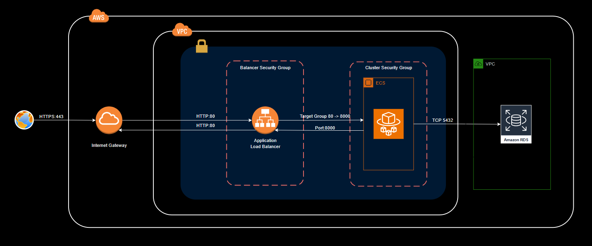
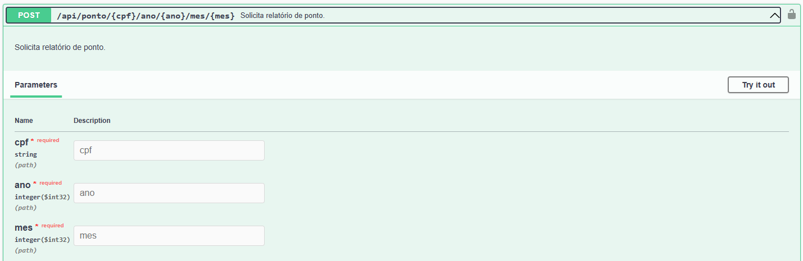
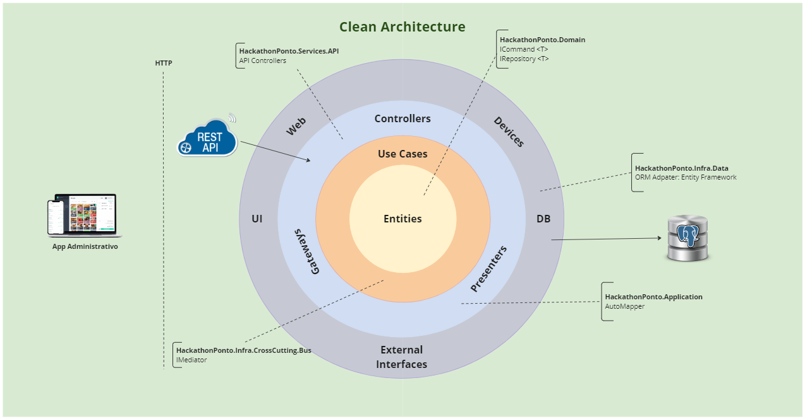

# [FIAP - Pos Tech] Hackathon

#### Sumário
   * [O projeto](#o-projeto)
   * [Documentações](#documentações)
   * [Pré-requisitos](#pré-requisitos)
   * [Como rodar a aplicação <g-emoji class="g-emoji" alias="arrow_forward" fallback-src="https://github.githubassets.com/images/icons/emoji/unicode/25b6.png">▶️</g-emoji>](#como-rodar-a-aplicação-️)
   * [Como rodar a aplicação na nuvem <g-emoji class="g-emoji" alias="arrow_forward" fallback-src="https://github.githubassets.com/images/icons/emoji/unicode/25b6.png">▶️</g-emoji>](#como-rodar-a-aplicação-localmente-%EF%B8%8F)
   * [Tecnologias](#tecnologias)
   * [Arquitetura e Padrões](#arquitetura-e-padrões)
   * [Estrutura da solução](#estrutura-da-solução)
   * [Desenvolvedores ](#desenvolvedores-octocat)

## O projeto

Este projeto consiste no desenvolvimento de um MVP de sistema de ponto eletrônico, como projeto final da POSTECH FIAP - SOFTWARE ARCHITECTURE no formato de Hachathon proposto pelos professores Luiz Zenha, Erick Muller, José Rubens.

## Documentações

### Desenho da solução MVP

**Requisitos funcionais MVP**

1. **Autenticação de Usuário**: O sistema deve permitir que os usuários se autentiquem usando um nome de usuário ou matrícula e senha.

>**SOLUÇÃO**: *Ao cadastrar um Funcionário é disparado um evento para criação do seu Usuário no sistema com o perfil COLABORADOR. O LOGIN é o CPF do funcionário e a SENHA INICIAL é **1234** (para facilitar os testes e demonstrações).*

2. **Registro de Ponto**: O sistema deve permitir que os usuários registrem o horário de entrada, intervalos e saída do trabalho. Isso deve incluir a data e a hora exatas do registro. O usuário apenas registra o evento, e o sistema obtém o horário do momento do registro.

>**SOLUÇÃO**: *A API de registro do ponto exige apenas que o usuário esteja logado, o sistema permite até 4 registros de ponto por dia, sendo:*
>
   >* *E1: Entrada 1 (primeiro registro do dia);*
   >* *S1: Saída 1;*
   >* *E2: Entrada 2;*
   >* *S2: Saída 2.*

3. **Visualização de Registros**: O sistema deve permitir que os usuários visualizem seus registros de ponto. Isso deve incluir todos os detalhes, como data, hora de entrada, intervalos e saída, e total de horas trabalhadas no dia.

>**SOLUÇÃO**: *Um usuário logado pode consultar os lançamentos de pontos diretamente pela API de consulta do ponto diário **GET /api/ponto/{cpf}/ano/{ano}/mes/{mes}/dia/{dia}***

>***OBS.:** Um usuário com o perfil COLABORADOR pode consultar apenas os seus próprios lançamentos.*

4. **Relatórios**: O sistema deve ser capaz de gerar o espelho de ponto mensal com base nos registros de ponto do mês fechado (anterior) e
enviar esse relatório por e-mail ao solicitante. (Listagem das datas, batimentos de ponto e total de horas trabalhadas)

>**SOLUÇÃO**: *O sistema permite a consulta mensal diretamente pela API **GET /api/ponto/{cpf}/ano/{ano}/mes/{mes}** ou solicitando o envio do relatório pela API **POST /api/ponto/**.*

5. **Segurança**: O sistema deve garantir que os dados dos usuários sejam armazenados de forma segura e que a privacidade seja mantida.

>**SOLUÇÃO**: *Todas as API's, com exceção do login, requerem que o usuário esteja autenticado. A identificação do perfil do usuário está registrado no JWT, usuários com o perfil COLABORADOR podem acessar apenas os seus próprios lançamentos.*

6. **Disponibilidade**: O sistema deve estar disponível 24/7 para permitir que os usuários registrem seu ponto a qualquer momento, e o tempo de resposta dos serviços de marcação de ponto deve ser de até 5 segundos.

>**SOLUÇÃO**: *O sistema está hospedado na AWS, o que permite a disponibilidade 24/7 e a escalabilidade dos serviços de acordo com a demanda e horários previamente definidos.*

### Desenho da solução evolutiva (fase 2)

**Requisitos funcionais versão evolutiva (fase 2)**

1. **Edição de Registros**: Em caso de erros, o sistema deve permitir que os usuários editem seus registros de ponto. No entanto, essa funcionalidade deve ser restrita e possivelmente necessitar de aprovação de um supervisor.

>**SOLUÇÃO**: *Nestes casos, o procedimento será a abertura de um chamado para concessão de autorização, todo funcionário precisará estar vinculado a um gestor que receberá a solicitação. Uma vez aprovada, o sistema permitirá a correção do registro.*

3. **Notificações**: O sistema deve ser capaz de enviar notificações para lembrar os usuários de registrar seu ponto.

>**SOLUÇÃO**: *Para o envio de notificações, a proposta é a criação de um serviço de notificação na AWS (SNS), que monitora os lançamentos efetuados pelos usuários e dispara as notificações de acordo com as regras previamente definidas. Permitindo o envio de e-mails, sms e push.*
   
5. **Administração**: Deve haver uma interface de administração para gerenciar usuários, aprovar edições de registros e visualizar relatórios.

>**SOLUÇÃO**: *Atualmente a utilização de perfis de usuários já permite segregar e controlar os acessos às API's e relatórios, para evolução do sistema, a proposta é a criação de um processo adicional para aprovar a edição de registros considerados críticos e que, por isso, dependem de uma supervisão.*

7. **Relatórios**: O sistema deve ser capaz de gerar os relatórios com visão administrativa, para uso dos gestores.

>**SOLUÇÃO**: *Serviços específicos aos perfis de gestão, como os relatórios de produtividade, de ocorrências e/ou de auditoria, terão acesso restrito aos perfis de Administrador e Gerente de RH (novo perfil).*

## Pré-requisitos

- SDK do .NET 7.0: Baixe em https://dotnet.microsoft.com/pt-br/download/dotnet/7.0.
- Docker: https://docs.docker.com/engine/install/

- IDE de sua preferência: pode ser executado com o Visual Studio Code (Windows, Linux or MacOS).

## Como rodar a aplicação localmente ▶️

1. Suba os containers (aplicação e banco de dados) utilizando o docker compose

   `docker-compose up -d`

2. Teste o sistema através do swagger:

   http://localhost:8000/swagger/index.html

3. Usuários previamente cadastrados

   * **Login**: 28507433057   **Perfil**: Administrador
   * **Login**: 06997172059   **Perfil**: Colaborador
   * **Login**: 02231416077   **Perfil**: Colaborador

      `Todas as senhas são: 1234`

## Como rodar a aplicação na nuvem ▶️

1. Consulte o repositório Terraform-Infra:

   https://github.com/grupo-7-fastfood-pos-soat-fiap/terraform-infra

## Tecnologias

- Runtime do .NET 7.0.5
    - Suporte para o Visual Studio
        - Visual Studio 2022 (v17.6)
        - Visual Studio 2022 for Mac (v17.6)
    - C# 11.0
    - ASP.NET WebApi
    - Entity Framework
    - AutoMapper
    - Swagger UI
- PostgreSQL 
- Docker

## Arquitetura e Padrões

- Arquitetura Limpa (Clean Architecture)
- Domain Driven Design (DDD)
- Domain Events
- CQRS
- Unit of Work
- Repository

## Estrutura da solução

 

## Desenvolvedores :octocat:
SOAP2 - Grupo 7

| [ Wellerson Willon Reis](https://github.com/brwillon) | [ Ana Luisa Bavati](https://github.com/analuisabavati) |  [ Luis Fernando](https://github.com/luisfernandodass) |
| :---: | :---: | :---:
